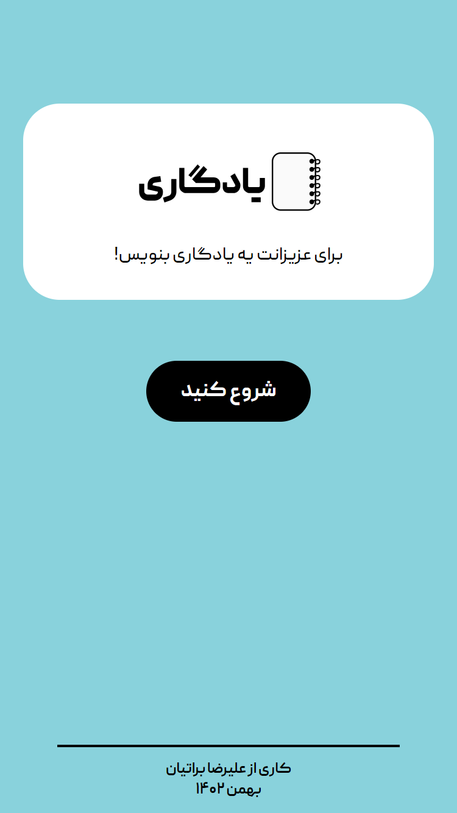

# Yadegari
Yadegari is a website for sharing memos with your friends.

# Use

You can use a live deployment [here](https://yadegari.alirezabaratian.com/)

# Screenshot



# Deploy

In order to deploy this project for your personal use, you need a linux server with MongoDB and Node.js installed and running.

### Run

Clone the repo:

```bash

git clone https://github.com/AlirezaBaratian/yadegari.git
cd yadegari

```

Install the dependencies:

```bash

npm i

```

Assign a local port for Express instance:

```bash

PORT=<your_port>
echo "PORT=$PORT" > .env 

```

Install pm2 and run the project as a service:

```bash

npm i -g pm2
pm2 start app.js --name yadegari
pm2 save

```
